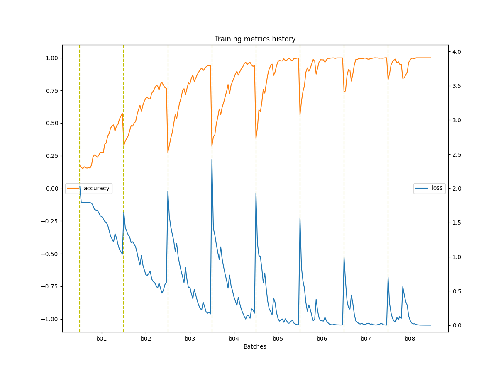
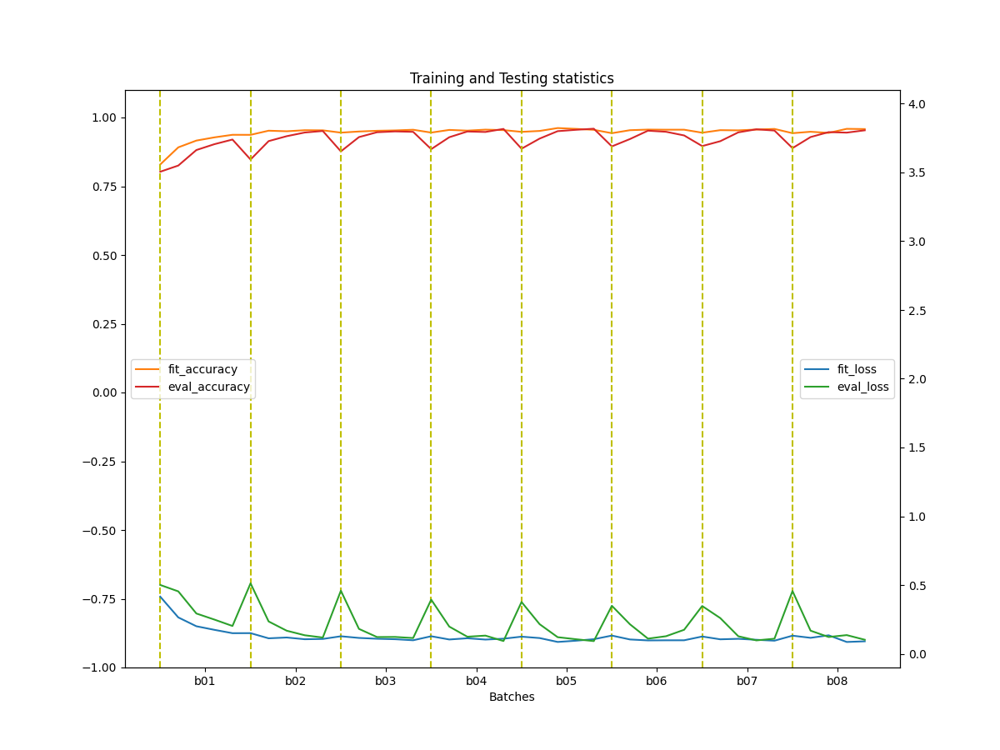
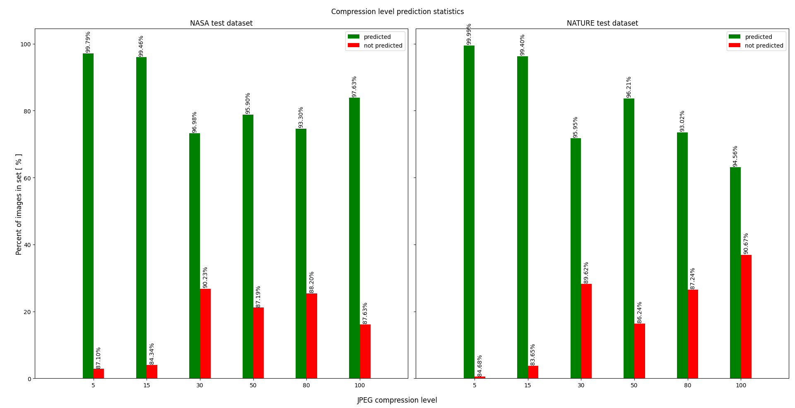
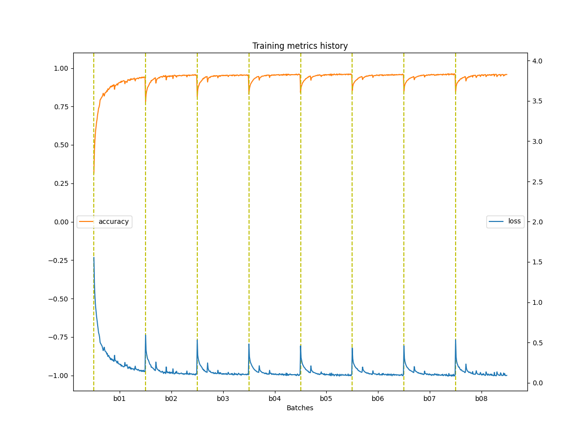
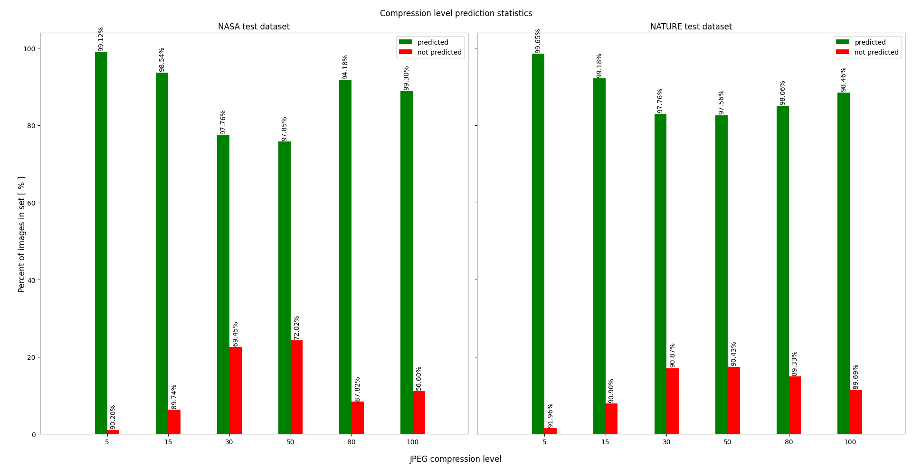

# Example charts for model statistics

## Big model (224x224 px images) charts

> Training history

> Training statistics

> Predicition statistics

## Smaller model (28x28 px images) charts

> Training history

> Training statistics

> Predicition statistics

